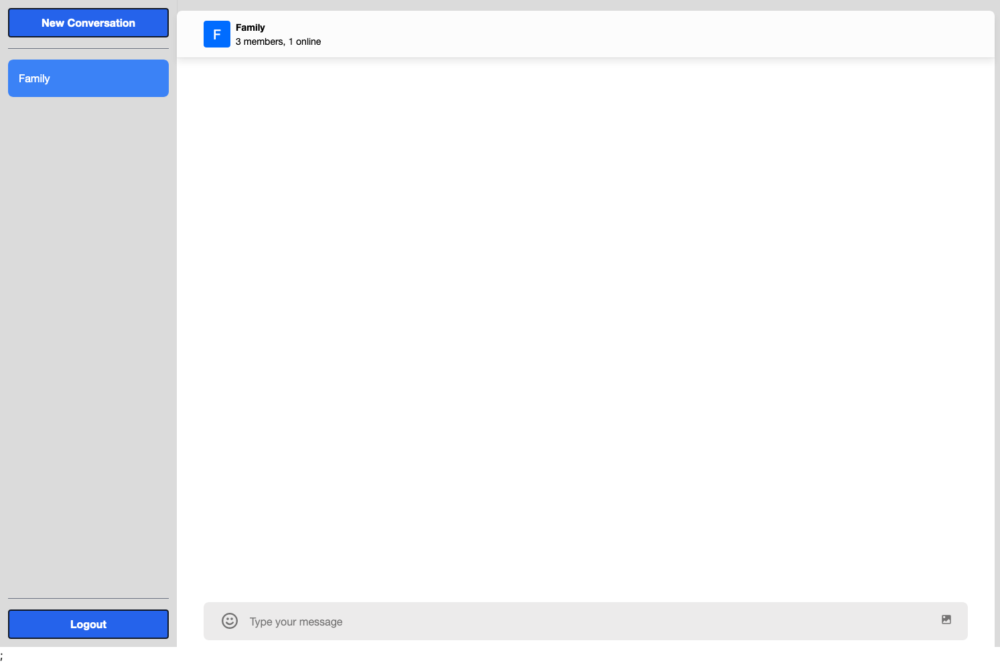
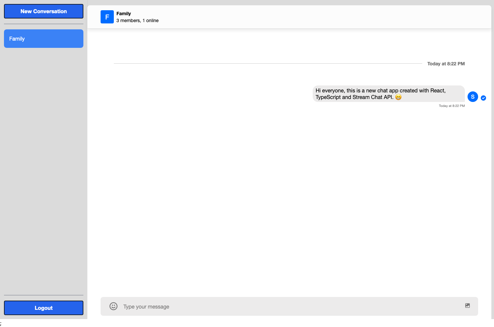
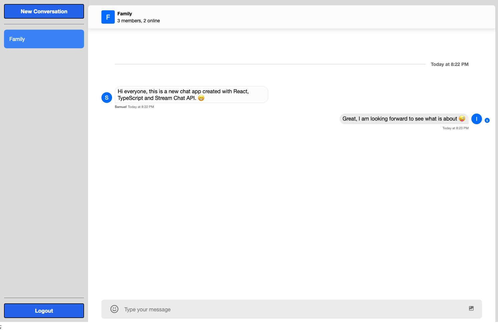

# Chatify Web Application

A chat application that allows users to send and reply to messages in real time using the [Stream Chat API](https://getstream.io/chat/)

# Getting Started

- Clone this repository to your local machine
- Install Node.js dependencies in both folders; client and server
  - `npm instal`

First, run the development server:

```
cd server/
npm run dev
```

Second, run the client

```
cd client/
npm run dev
```

To access to application, open browser to `http://localhost:5173/` while the server is running.

## API Routes

```
Home: http://localhost:5173/
Login: http://localhost:5173/login
Signup: http://localhost:5173/signup
```

## Technologies Used:

- React
- Typescript
- NodeJS / Fastify (Similar to Express.js)
- [Stream Chat API](https://getstream.io/chat/)

## Media




